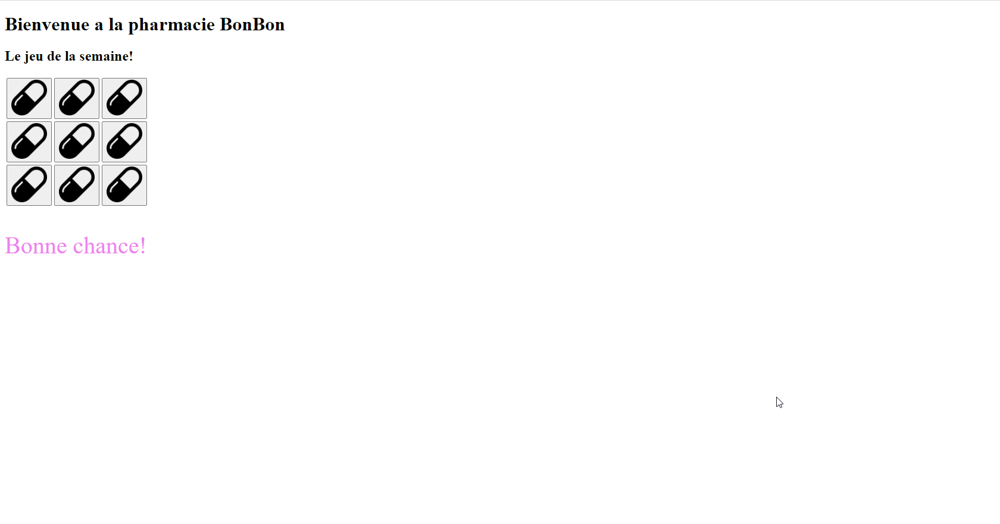
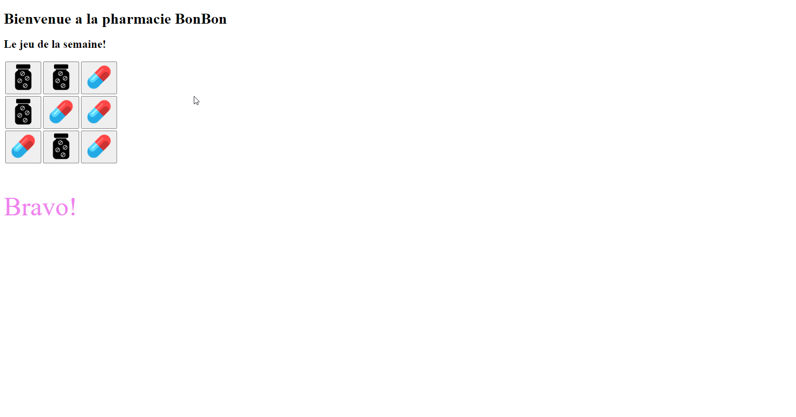
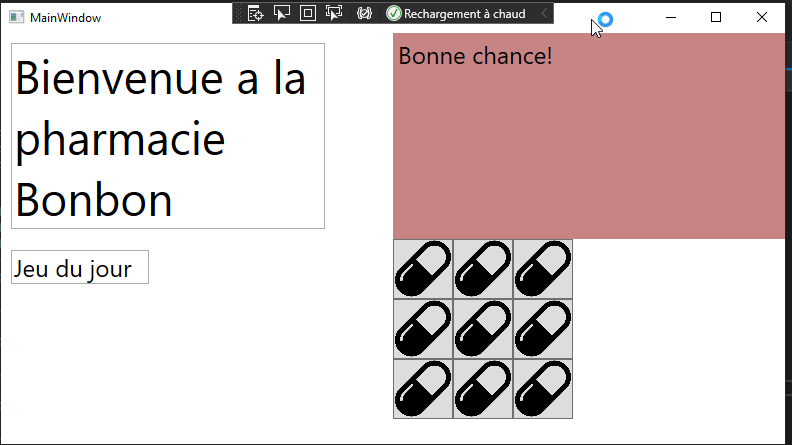
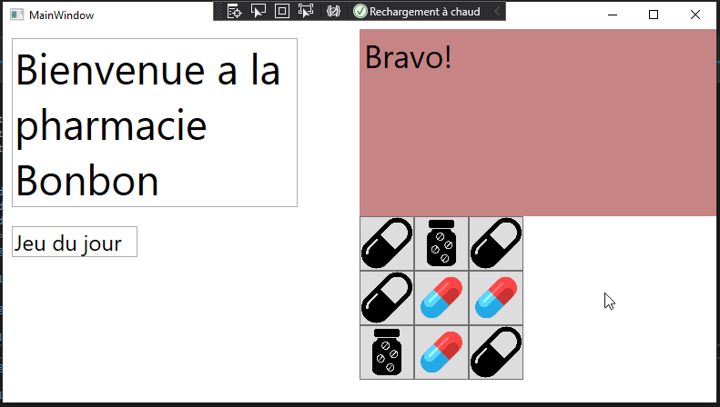

# Examen pratique: Pharmacie BonBon, gamification

## Application web

### État initial web



### État final web



### Code web

```html javascript
<!DOCTYPE html>
<html lang="en">
<head>
    <meta charset="UTF-8">
    <meta http-equiv="X-UA-Compatible" content="IE=edge">
    <meta name="viewport" content="width=device-width, initial-scale=1.0">
    <link rel="stylesheet" type="text/css" href="./web.css" />
    <title>Pharmacie BonBon</title>

    <script>
        nbPillsTrouvees = 0;

        function changeImage(btn) {
          var img = btn.querySelector('img');
          if (img.src.endsWith('image1.png')) {
            var chance = Math.floor(Math.random() * 4);
            if (chance == 0){
                img.src = './image2.png';
                nbPillsTrouvees++;
            }
            else {
                img.src = './image3.png';
            }
          } else {
            if (img.src.endsWith('image2.png')){
                nbPillsTrouvees--;
            }
            img.src = './image1.png';
          }

          if (nbPillsTrouvees >= 3) {
            document.querySelector('#winornot').textContent = "Bravo!"
            document.getElementById('winornot').style.fontSize = '3.5rem'
          } else {
            document.querySelector('#winornot').textContent = "Bonne chance!"
          }
        }
    </script>
</head>
<body>
    <h1>Bienvenue a la pharmacie BonBon</h1>
    <h2>Le jeu de la semaine!</h2>
    <table>
        <tr>
            <td><button onclick="changeImage(this)"></button></td>
            <td><button onclick="changeImage(this)"></button></td>
            <td><button onclick="changeImage(this)"></button></td>
        </tr>
        <tr>
            <td><button onclick="changeImage(this)"></button></td>
            <td><button onclick="changeImage(this)"></button></td>
            <td><button onclick="changeImage(this)"></button></td>
        </tr>
        <tr>
            <td><button onclick="changeImage(this)"></button></td>
            <td><button onclick="changeImage(this)"></button></td>
            <td><button onclick="changeImage(this)"></button></td>
        </tr>
    </table>

    <p id="winornot"> Bonne chance! </p>
</body>
</html>
```

## Application bureau

### État initial bureau



### État final bureau



### Code bureau

#### Interface

```xml
<Window x:Class="BonbonDesktop.MainWindow"
        xmlns="http://schemas.microsoft.com/winfx/2006/xaml/presentation"
        xmlns:x="http://schemas.microsoft.com/winfx/2006/xaml"
        xmlns:d="http://schemas.microsoft.com/expression/blend/2008"
        xmlns:mc="http://schemas.openxmlformats.org/markup-compatibility/2006"
        xmlns:local="clr-namespace:BonbonDesktop"
        mc:Ignorable="d"
        Title="MainWindow" Height="450" Width="800">
    <Grid>
        <Grid.ColumnDefinitions>
            <ColumnDefinition/>
            <ColumnDefinition/>
        </Grid.ColumnDefinitions>

        <Grid Grid.Column="1">
            <Grid>
                <Grid.RowDefinitions>
                    <RowDefinition/>
                    <RowDefinition/>
                </Grid.RowDefinitions>
                <Label x:Name="winOrNot" Content="Bonne chance!" FontSize="24" Background="#FFC78484"/>
                <Grid Grid.Row="1">
                    <Grid.RowDefinitions>
                        <RowDefinition Height="60" />
                        <RowDefinition Height="60" />
                        <RowDefinition Height="60" />
                    </Grid.RowDefinitions>
                    <Grid.ColumnDefinitions>
                        <ColumnDefinition Width="60"/>
                        <ColumnDefinition Width="60"/>
                        <ColumnDefinition Width="60"/>
                    </Grid.ColumnDefinitions>
                    <Button Click="ChangeImage" 
                    Grid.Column="0">
                        <Image Source="image1.png" />
                    </Button>
                    <Button Click="ChangeImage" 
                    Grid.Column="1">
                        <Image Source="image1.png" />
                    </Button>
                    <Button Click="ChangeImage" 
                    Grid.Column="2">
                        <Image Source="image1.png" />
                    </Button>

                    <Button Click="ChangeImage" 
                    Grid.Row="1" 
                    Grid.Column="0">
                        <Image Source="image1.png" />
                    </Button>
                    <Button Click="ChangeImage" 
                    Grid.Row="1" 
                    Grid.Column="1">
                        <Image Source="image1.png" />
                    </Button>
                    <Button Click="ChangeImage" 
                    Grid.Row="1" 
                    Grid.Column="2">
                        <Image Source="image1.png" />
                    </Button>

                    <Button Click="ChangeImage" 
                    Grid.Row="2" 
                    Grid.Column="0">
                        <Image Source="image1.png" />
                    </Button>
                    <Button Click="ChangeImage" 
                    Grid.Row="2" 
                    Grid.Column="1">
                        <Image Source="image1.png" />
                    </Button>
                    <Button Click="ChangeImage" 
                    Grid.Row="2" 
                    Grid.Column="2">
                        <Image Source="image1.png" />
                    </Button>
                </Grid>
            </Grid>

        </Grid>
        <TextBox HorizontalAlignment="Left" Margin="10,10,0,0" Text="Bienvenue a la pharmacie Bonbon" TextWrapping="Wrap" VerticalAlignment="Top" Width="314" FontSize="46"/>
        <TextBox HorizontalAlignment="Left" Margin="10,217,0,0" Text="Jeu du jour" TextWrapping="Wrap" VerticalAlignment="Top" Width="138" RenderTransformOrigin="-0.083,-0.758" FontSize="24"/>
    </Grid>
</Window>
```

#### Actions

```c#
using System;
using System.Collections.Generic;
using System.Linq;
using System.Text;
using System.Threading.Tasks;
using System.Windows;
using System.Windows.Controls;
using System.Windows.Data;
using System.Windows.Documents;
using System.Windows.Input;
using System.Windows.Media;
using System.Windows.Media.Imaging;
using System.Windows.Navigation;
using System.Windows.Shapes;

namespace BonbonDesktop
{
    /// <summary>
    /// Interaction logic for MainWindow.xaml
    /// </summary>
    public partial class MainWindow : Window
    {
        int nbPillsTrouvees = 0;

        public MainWindow()
        {
            InitializeComponent();
        }

        private void ChangeImage(object sender, RoutedEventArgs e)
        {
            Button btn = (Button)sender;
            Image img = (Image)btn.Content;

            if (img.Source.ToString().EndsWith("image1.png"))
            {
                Random rnd = new Random();
                int chance = rnd.Next(4);
                if (chance == 0)
                {
                    img.Source = new BitmapImage(new Uri("./image2.png", UriKind.Relative));
                    nbPillsTrouvees += 1;
                }
                else
                {
                    img.Source = new BitmapImage(new Uri("./image3.png", UriKind.Relative));
                }
            }
            else
            {
                if (img.Source.ToString().EndsWith("image2.png"))
                {
                    nbPillsTrouvees -= 1;
                }
                img.Source = new BitmapImage(new Uri("./image1.png", UriKind.Relative));

            }

            if (nbPillsTrouvees >= 3)
            {
                winOrNot.Content = "Bravo!";
                winOrNot.FontSize = 35;
            }
            else
            {
                winOrNot.Content = "Bonne chance!";
            }
        }
    }
}

```
